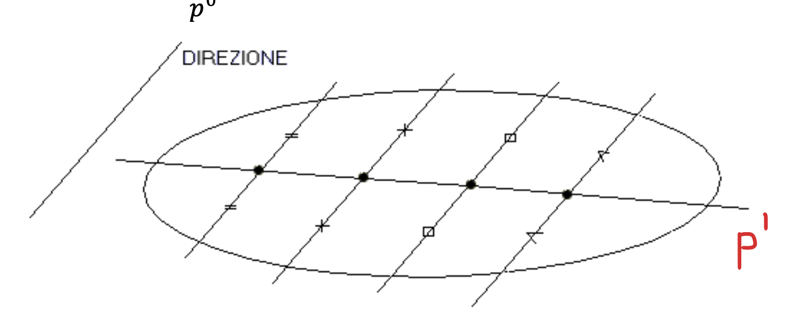
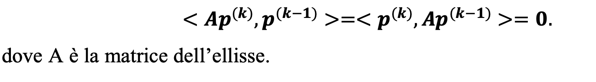
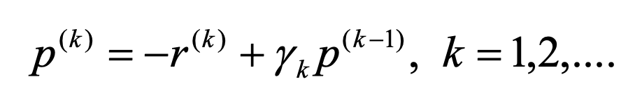
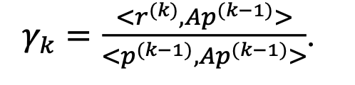
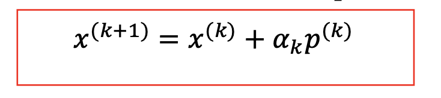
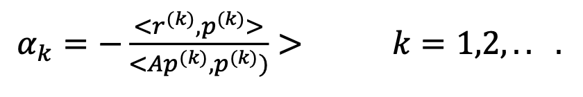
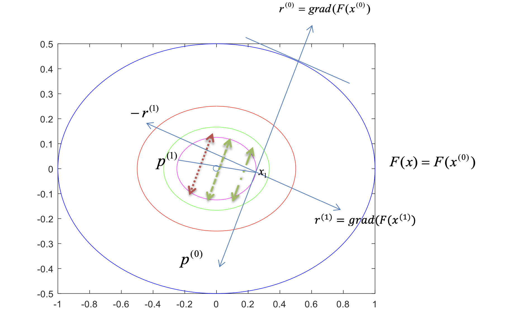
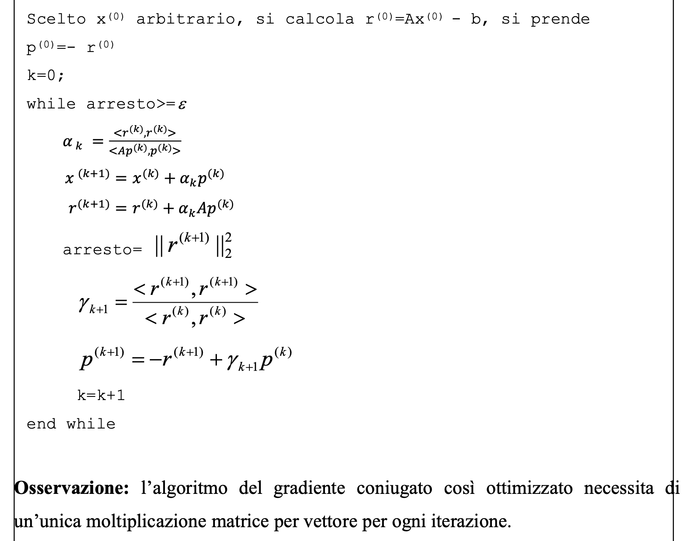

DEFINIZIONE DI DIREZIONI CONIUGATE:
Consideriamo una ellisse ed una direzione p0, tutti i punit medi delle corde parallele alla direzione sono allineati e formano una direzione p1
che si dice CONIUGATA alla direzione data:

Due direzioni p(k) e p(k-1) coniugate rispetto all'ellisse rispettano la seguente relazione:

 (relazione n.5)

1. METODO DEL GRADIENTE CONTINUO:
-In questo metodo la scelta della direzione di discesa p(k) tiene conto non solo del gradiente della F(x(k)) cioè r(k), ma anche della 
 direzione di discesa dell'iterazione precedente p(k-1).
-In particolare, al generico passo k, partendo dal punto x(k) che è stato ottenuto muovendosi lungo la direzione p(k-1) e in cui è stato calcolato
 il residuo r(k), si sceglie la nuova direzione di discesa come quella appartenenete al piano π(k) passante per x(k).
-π(k) rappresenta il piano tangente che fornisce una approssimazione della funzione obbiettivo passante per x(k) e individuato dai due vettori ortogonali
 r(k) e p(k-1)

-Formula generica per la scelta di p(k) al passo k:

 (relazione n.6)

-Poichè il punto di minimo nel piano π(k) coincide con il centro dell'ellisse, il parametro gamma(k) sarà scelto in modo che la direzione p(k)
 punti verso il centro dell'ellisse, cioè sia il coniugato, rispetto all'ellisse, di p(k-1), ciò significa soddisfare la relazione 5.
-Sostituendo la relazione 6 nella 5 si ottiene:

 (relazione n.5bis)

-Sostituendo la relazione 5bis nella relazione 6, viene calcolato così il nuovo punto x(k) come punto di minimo nella direzione p(k):

 (relazione n.7)

dove il parametro alpha(k) sarà ugual a:

 (relazione n.8)

-Di seguito una immagine per far comprendere meglio come procede il metodo:

2. METODO DEL GRADIENTE CONIUGATO:
-Tale metodo è una ottimizzazione del metodo del gradiente continuo, che tramite alcune semplificazioni (guardare slide) arriva a questo pseudo-codice:

-A parità di valori di K(A) (condizionamento matrice), questo metodo è più veloce del metodo di Steepest Descent.

Osservazione:
Se il rapporto fra l'autovalore massimo e l'autovalore minimo è molto grande, l'elissoide sarà molto allungata, quindi si può dire che la matrice A è mal condizionata.